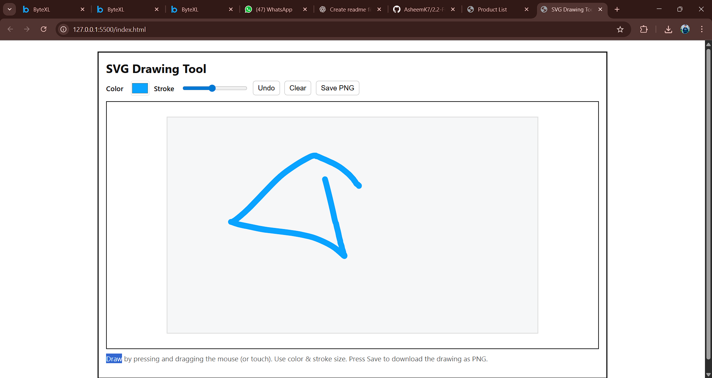

# SVG Drawing Tool

A simple web-based drawing tool built using **HTML, CSS, JavaScript, and SVG**.  
This project allows users to draw freehand paths interactively using the mouse.

## 🚀 Features
- Draw freehand shapes using mouse drag
- Real-time updates while drawing
- Clear and minimal UI
- Built using **JavaScript DOM Manipulation + SVG**

## 📷 Screenshot
Here is the expected output:

## 🛠️ Technologies Used
- HTML5
- CSS3
- JavaScript
- SVG (Scalable Vector Graphics)

## 📂 Project Setup
1. Open the project folder in **VS Code**
2. Create the following files:
   - `index.html`
   - `style.css`
   - `script.js`
3. Add code for **HTML (SVG Canvas)**, **CSS (styling)**, and **JavaScript (event handling)**.
4. Open `index.html` in your browser to use the tool.

## 🖊️ How to Use
1. Click and drag inside the SVG canvas to draw.
2. Release the mouse button to finish the stroke.
3. Repeat to draw multiple shapes.

---
✨ **Enjoy drawing with your SVG Drawing Tool!**
